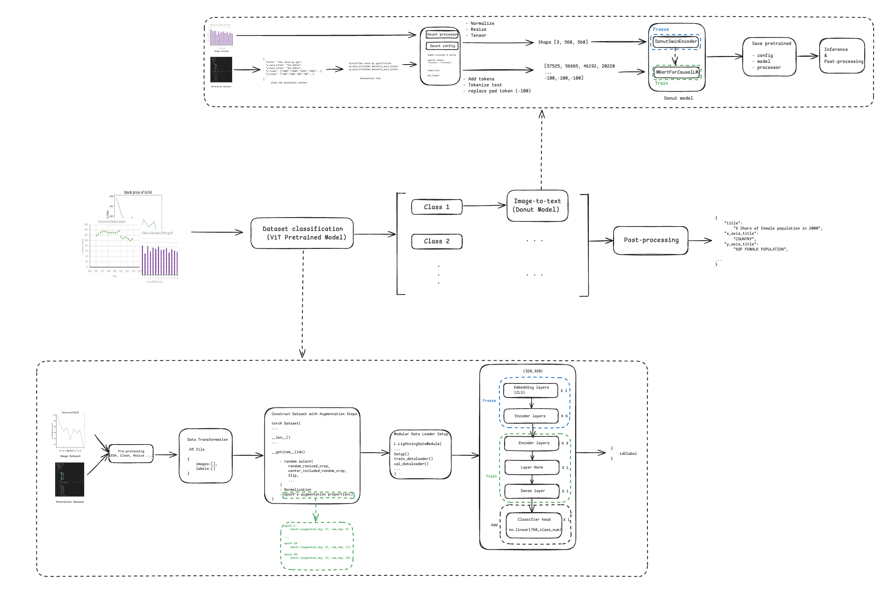

# Image to text

This project is to recognize images (plots/charts) and identify the text information in the image.

This projects includs two main body:

## 1. image type recognition

Using Vision Transformer pretrained model to do the classification

src: [image_recognition](src/image_recognition)

## 2. content recognition

Using Donut (Swin transformer model variant) to do the text extraction.

src: [content_recognition](src/content_recognition)

