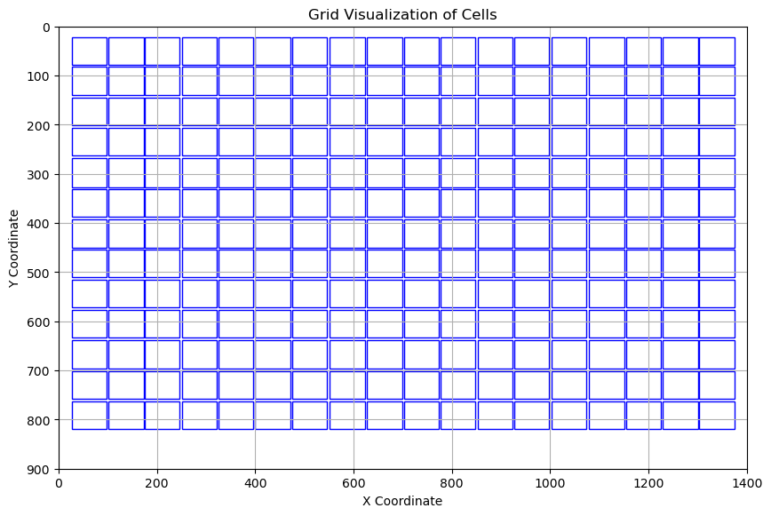
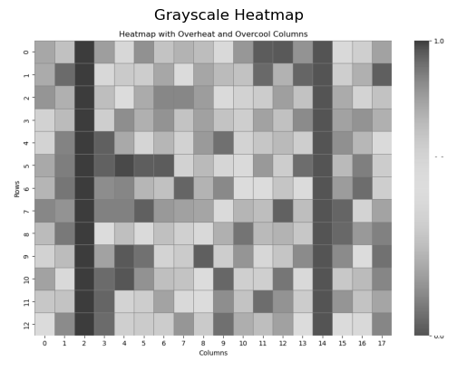
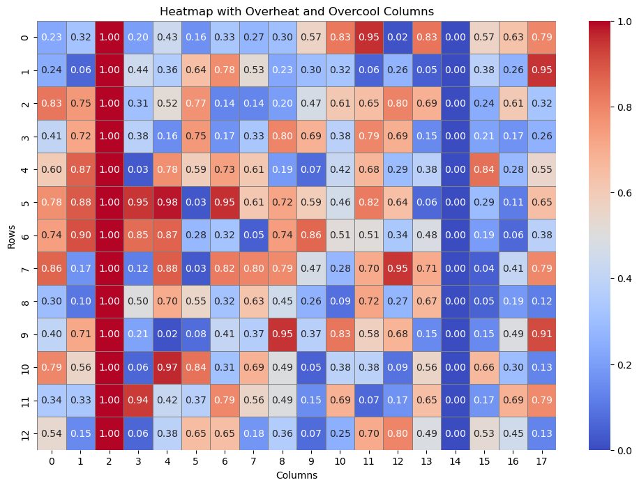
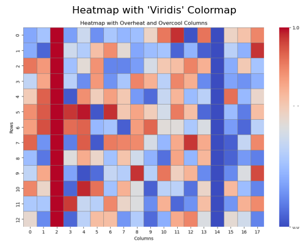

# Heatmap recognition algorithm

The task of this project is to judge a single heatmap image and detect whether there is a column in each heatmap image that is completely overheated. If so, return the corresponding column number.

If this project uses a small amount of training data, it can use a simple deep neural network for training and achieve good results, because the features of the image to be detected are very obvious and the edge features are very clear. However, here we did not choose to use a deep network, but only built a logical algorithm based on a picture for reasoning.

## Details

### Locate the number of rows and columns in the heatmap

In order to determine whether all cells in a certain column or columns in each heatmap are overheated, we need to locate each cell in the image. The first step is to determine the total number of rows and columns.

1. Multiple sequences are randomly extracted from the pixel sequences on the horizontal and vertical axes of the pixel matrix.

2. Calculate each sequence, find all subsequences consisting of the same consecutive numbers, and count the lengths of all subsequences as the target value.

3. Count all the calculated target values, and find the target value that appears the most times. This value corresponds to the number of rows and columns of the heatmap.

4. It is worth noting that there are numbers on each cell of the heatmap. If the pixel corresponding to the number is black, then they will truncate the sequence that should be continuous, thus causing an impact. Therefore, we will select multiple sequences for judgment.

5. In addition, the target values ​​obtained may contain many values ​​of 1 or very small numbers, but according to the actual situation, such values ​​cannot be used as the length or width of the cell, so a filter is added to the algorithm to ignore the values ​​that are considered impossible.

6. Secondly, the size of each cell may not be very consistent, and there may be a difference of 1-3 pixels at the pixel level. A tolerance parameter is added to the algorithm to allow a value to fluctuate within a certain range. For example, if the detected target value is determined to be 10, if tolerance=1, then 9 and 11 will also be counted as the same as 10.

7. It is worth noting that in order for the randomly extracted sequence to fall accurately on the main body of the image rather than the edge, each random extraction is limited to the middle 1/2 of the entire image.

8. If the above operation uses the RGB pixel matrix, it will be difficult to determine the boundary range of each cell, because each cell is composed of three layers of matrices: red, green, and blue. If one layer is analyzed separately, the edge may be very blurred. Therefore, when determining the number of rows and columns, grayscale images are used for analysis.

9. After calculating the number of rows and columns, we can calculate the vertex position of each cell. Each cell has 4 vertices, and we can obtain all the vertex coordinates through calculation to locate each cell.

   

10. After getting the location of each cell, we calculate the pixel of each cell, select the most frequent number in the meigecell, and replace all other values ​​that appear in the cell with the most frequent number, thereby eliminating the impact of the digital pixel.

    

    

11. We have now obtained the positions of all cells and eliminated the noise from the image. Then we calculate the pixel value of each cell in each column. If the pixel value exceeds a certain threshold (threshold is defined by us), then this column is considered to be completely overcooled or overheated.
12. Because in grayscale images, the pixels corresponding to overcooling or overheating are very low. As shown in the figure above, we get the result that column 3 and column 15 are both overheated or undercooled. In fact, column 3 is correct and column 15 is overcooled. So after obtaining the column number, we need to make further judgments.
13. This time, the RGB image will be called to calculate the values ​​of the red layer and blue layer of all cells at the corresponding position. If the red layer value - blue layer value > 100 in a column, we will consider this column to be overheated, otherwise it is too cold and will be removed. Finally, the correct result is obtained.

